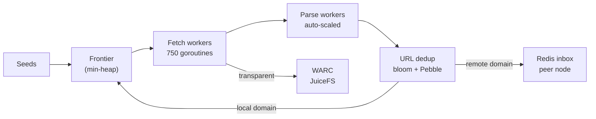

# krowl

Distributed web crawler. Each node is self-sufficient with local Pebble storage. Consul provides service discovery and builds the consistent hash ring for domain sharding.

## Architecture



**Distributed mode:** Consul hash ring shards domains across nodes. Cross-shard URLs forwarded via Redis inbox. Each node runs: crawler + local Redis + Pebble + JuiceFS mount.

**Standalone mode:** Single node, no Consul/Redis (`--standalone`).

## Components

| Component | Implementation | Purpose |
|-----------|---------------|---------|
| URL queue | Pebble (per-domain FIFO) | Persistent frontier storage, survives restarts |
| Dedup | Bloom filter + Pebble | Fast in-memory check, exact disk-backed persistence |
| Domain state | Binary-encoded in Pebble | Crawl delay, backoff, error counts, robots.txt, dead flag |
| Frontier | Min-heap by next-fetch time | O(log n) scheduling with politeness delays |
| Sharding | Consistent hash ring (Consul) | Domain ownership across nodes, topology watches |
| WARC | gowarc at transport layer | Transparent request/response capture to rotating gzip files |
| Metrics | Prometheus + Grafana | Pebble internals, throughput, queue depths, Redis pool stats |
| Profiling | Pyroscope (push) + pprof | Continuous profiling, on-demand heap/goroutine dumps |

## Durability

All state survives crashes and restarts:

- **URL queue & dedup:** Pebble LSM on disk, survives crashes
- **Domain state:** persisted every 60s and on graceful shutdown
- **Frontier:** rebuilt from URL queue on startup (`RebuildFrontier()`)
- **Bloom filter:** rewarmed from Pebble on startup (`WarmBloom()`)
- **Graceful shutdown:** SIGINT/SIGTERM triggers drain workers, flush WARC, save state, close DBs

## Performance

**Memory:** `GOMEMLIMIT` auto-set from cgroup/system memory (default 70%). Inline FNV hashing (no allocator overhead). Lightweight robots.txt parser without regex compilation, saving ~10KB/domain vs `temoto/robotstxt`. Soft-404 content tracker capped at 500K entries with half-eviction.

**Network:** local CoreDNS with 500K-entry cache (1h TTL). Aggressive timeouts: 2s dial, 2s TLS, 3s response header, 5s total. HTTP/1.1 only (required for gowarc per-connection WARC recording).

**Storage:** Pebble tuned for throughput with 256MB block cache + 64MB memtable per DB and batch deletes on domain drop. Bloom filter at 1% FP rate using FNV-128a double hashing (Kirsch-Mitzenmacher), ~120MB for 50M URLs.

**Concurrency:** 750 fetch workers (I/O-bound, fixed). Parse workers auto-scaled from NumCPU to 64 based on channel backpressure: scale up aggressively at >50% fill, scale down after 30s sustained <10%. 16 WARC writer goroutines.

**Politeness:** adaptive per-domain rate limiting using EMA latency x 5 multiplier, clamped 250ms to 30s. Exponential backoff after 5 consecutive errors (2^n minutes, capped 1h). Domain permanently abandoned after 10 errors. DNS NXDOMAIN triggers immediate death.

**Sharding:** consistent hash ring with 128 vnodes/node, FNV-1a, O(log n) lookup. Cross-shard URLs forwarded via Redis LPUSH/LPOP in batches of 500.

## Usage

```bash
make build                    # build for local OS
make build-linux              # cross-compile for deployment
make test                     # run tests
make deploy                   # stop -> scp binary -> start (all workers via Tailscale)
make deploy-seeds             # upload seed list to JuiceFS
```

Key flags:

```
--standalone          Single-node mode (no Consul/Redis)
--seeds PATH          Seed domains file (default: /mnt/jfs/seeds/top100k.txt)
--fetch-workers N     Fetcher goroutines (default: 750)
--parse-workers-max N Max parser goroutines (default: 64, auto-scaled)
--max-frontier N      Global URL cap / backpressure (default: 50M)
--warc-dir PATH       WARC output directory
--pyroscope URL       Enable continuous profiling
```

## Infrastructure

DigitalOcean cluster managed by OpenTofu. See [`terraform/README.md`](terraform/README.md).

```
Master (s-2vcpu-4gb): Consul server, Redis (JuiceFS metadata), Prometheus, Grafana
Workers (s-4vcpu-8gb-amd x N): Crawler, local Redis, Pebble, JuiceFS -> DO Spaces
Networking: VPC 10.100.0.0/16, public inbound blocked, Tailscale for management
```
